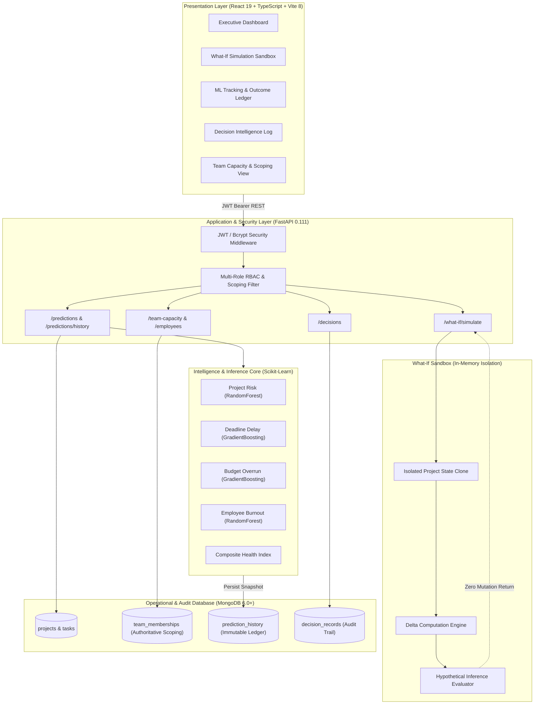

# NEXUSAI — AI-Powered Intelligent Automation Platform
### Enterprise Project Decision Intelligence, Predictive ML & Capacity-Driven Multi-PM System

[](https://fastapi.tiangolo.com)
[](https://react.dev)
[](https://www.typescriptlang.org)
[](https://python.org)
[](https://mongodb.com)
[](https://scikit-learn.org)
[]()

---

> ### ⚡ 2-Minute Recruiter Executive Summary
> **NexusAI** is an **Enterprise Project Decision Intelligence & Predictive Automation Platform** built for multi-PM organizations. It eliminates traditional agile blind spots by coupling **operational observability** with **production machine learning** ($\text{RandomForest}$ & $\text{GradientBoosting}$) and a **zero-mutation in-memory What-If simulation engine**.
> 
> * **Closed-Loop Intelligence**: $\text{OBSERVE} \rightarrow \text{PREDICT} \rightarrow \text{SNAPSHOT} \rightarrow \text{EXPLAIN} \rightarrow \text{RECOMMEND} \rightarrow \text{SIMULATE} \rightarrow \text{DECIDE} \rightarrow \text{EVALUATE}$.
> * **Zero Fake Data / Absolute Integrity**: ML Tracking preserves immutable prediction snapshots (`db.prediction_history`) and evaluates performance **solely** against authoritative real-world project completions (no synthetic ground truth).
> * **Strict Multi-PM Data Isolation**: Enforces **Team Capacity** direct membership as the single source of truth for PM employee scoping, preventing cross-PM data leakage with server-side HTTP 403 authorization.
> * **In-Memory What-If Sandbox**: Empowers managers to model hiring, descoping, task rebalancing, and budget adjustments in real-time with **100% zero live MongoDB mutation safety**.

---

## 1. Problem Statement

Modern enterprise software organizations suffer from persistent delivery failures, resource misallocation, and strategic blind spots:
1. **Lagging Indicators & Reactive Management**: Traditional tools (Jira, Linear, Asana) record *past* velocity and defect counts but cannot reliably forecast future completion bottlenecks, budget overruns, or engineer burnout before milestones fail.
2. **"Flywheel of Guesswork" in Decision-Making**: When milestones fall behind, project managers guess interventions (e.g. adding engineers, crunching overtime, descoping). Without simulation tools, interventions frequently backfire (Brooks' Law).
3. **Data Contamination & Fabricated Metrics**: Most predictive prototypes silently mutate database state during simulations or fabricate artificial ground-truth outcomes to make model dashboards appear active.
4. **Siloed Multi-PM Organizations**: In matrix enterprises, PMs lack cross-departmental visibility into available specialist bandwidth, leading to artificial capacity shortages, skill gaps, and burnout.

---

## 2. Solution

**NexusAI** bridges operational project tracking and decision science through an enterprise-grade platform:

```
  LIVE ENTERPRISE TELEMETRY (Tasks, Bugs, Sprints, Budgets, Capacity)
                                 │
                                 ▼
         MACHINE LEARNING PIPELINE (Scikit-Learn / Joblib)
         ├── Project Risk (RandomForestClassifier, v1.0)
         ├── Deadline Delay (GradientBoostingRegressor, v1.0)
         ├── Budget Overrun (GradientBoostingRegressor, v1.0)
         └── Employee Burnout (RandomForestClassifier, v1.0)
                                 │
                                 ▼
      IMMUTABLE PREDICTION SNAPSHOTS & OUTCOME TRACKING LEDGER
          (db.prediction_history - Features & Model Metadata)
                                 │
                                 ▼
         EXPLAINABLE RECOMMENDATIONS & WHAT-IF SIMULATION
     (In-Memory Read-Only Sandbox: Resource, Task, Schedule & Budget)
                                 │
                                 ▼
                   AUDITED DECISION LOG SYSTEM
            (Formal Quantitative Evidence & Human Governance)
                                 │
                                 ▼
         REAL-WORLD LIFECYCLE OUTCOME EVALUATION & AUDIT
       (MAE, RMSE, Accuracy, F1, Sample-Safety Trajectory Tracking)
```

NexusAI establishes an uncompromised audit trail: **every ML prediction is immutably snapshot**, **every decision is recorded with quantitative alternatives**, and **model evaluation occurs only after real-world completion**.

---

## 3. Key Features

* **Multi-Model Production ML Inference**:
  * Real-time risk classification (`LOW`, `MEDIUM`, `HIGH`) with feature importance weights.
  * Continuous regression predicting completion delay in days and budget overrun in USD.
  * Individualized, workload-based employee burnout risk indicators.
* **Immutable ML Tracking & Prediction Outcome Ledger**:
  * Persistent storage of exact feature vectors and model versions in `db.prediction_history`.
  * 15-minute feature-hash deduplication preventing redundant snapshot spam.
  * Real-world lifecycle auto-evaluation (actual delay computed strictly from completed project dates).
  * Sample-safe performance trajectory (`NO_EVALUATED_DATA`, `LIMITED_SAMPLE`, `SUFFICIENT_SAMPLE`).
* **In-Memory What-If Simulation Engine**:
  * Model 7 distinct scenario types: `RESOURCE_ADD`, `RESOURCE_REMOVE`, `RESOURCE_REALLOCATION`, `TASK_REALLOCATION`, `SCOPE_REDUCTION`, `SCHEDULE_CAPACITY_CHANGE`, `BUDGET_RESOURCE_CHANGE`.
  * In-memory delta evaluation with 100% guaranteed zero database mutation.
* **Team Capacity-Driven PM Employee Scoping**:
  * Active direct team membership in Team Capacity is the single authoritative source of truth for PM employee visibility, workload analytics, and task assignments.
  * Strict multi-PM isolation: unauthorized cross-PM queries return HTTP 403 Forbidden.
* **Formal Decision Intelligence Log**:
  * Moves management actions from `PENDING` $\rightarrow$ `APPROVED` / `REJECTED` $\rightarrow$ `EXECUTED`.
  * Captures rationale, trade-offs, baseline predictions, and simulated outcomes.
* **Automated Cross-PM Resource Optimization**:
  * Detects team skill gaps and identifies eligible specialist borrowing opportunities across organizational PM boundaries without mutating home team rosters.

---

## 4. Architecture

NexusAI is structured as an asynchronous multi-tier architecture with decoupled inference, simulation, persistence, and reactive presentation layers:



---

## 5. Tech Stack

| Layer | Technologies | Purpose |
| :--- | :--- | :--- |
| **Frontend** | React 19, TypeScript 6.0, Vite 8.2 | Type-safe, reactive single-page interface |
| **UI & Styling** | Modular Vanilla CSS, Glassmorphism, Recharts 3.10, Lucide-React | Premium enterprise dark mode & dynamic analytics |
| **Backend** | FastAPI 0.111, Python 3.12, Uvicorn, Pydantic V2 | High-throughput asynchronous REST API & validation |
| **Database** | MongoDB 6.0+, Motor 3.4.0 (AsyncIO Driver) | Scalable document store with compound indexing |
| **Machine Learning** | Scikit-Learn 1.4.2, XGBoost, NumPy, Pandas, Joblib | Model training, serialization, and sub-millisecond inference |
| **Security & Auth** | Python-Jose (JWT), Passlib (Bcrypt) | Multi-role authorization and token validation |
| **Auditing & Tests** | PyTest, Custom Automated Audit Suites | Verification of mathematical correctness and data integrity |

---

## 6. AI/ML Pipeline

NexusAI operates a production machine learning pipeline designed with strict leakage-prevention and chronological validation:

```
DATA GENERATION / INGESTION
   │  50,000 observations (V2 Controlled Enterprise Dataset)
   ▼
GROUP-AWARE & TEMPORAL SPLITTING (split_strategy.py)
   │  Holds out entire unseen projects and employees to prevent cross-entity leakage
   ▼
PREPROCESSING & FEATURE ENGINEERING
   │  StandardScaler normalization, velocity delta calculations, spending rates
   ▼
TRAINING & CROSS-BENCHMARKING (train_evaluate_certify.py)
   │  RF vs. GradientBoosting vs. XGBoost vs. HistGB vs. Baselines
   ▼
SERIALIZATION & ARTIFACT VERSIONING
   │  Models (.pkl) and Scalers stored in /models/ with version checksums
   ▼
LIVE PRODUCTION INFERENCE & SNAPSHOTS (ml_inference_service.py)
   │  Live telemetry evaluated -> Feature vector captured -> db.prediction_history
   ▼
REAL-WORLD OUTCOME EVALUATION
      Lifecycle completion observed -> Error computed -> Metrics updated
```

---

## 7. Backend Architecture

The backend is built around clean separation of concerns and robust security boundaries:

* **Entrypoint (`main.py`)**: Asynchronously initializes MongoDB connection pools, compound database indexes, and executes idempotent prediction snapshot baselines on startup.
* **REST Routers (`app/api/`)**:
  * `prediction_tracking.py`: Snapshot querying, outcome recording, portfolio-wide metrics, auto-evaluation.
  * `predictions.py`: Direct production ML inference endpoints.
  * `what_if.py`: Scenarios evaluation sandbox with zero database writes.
  * `decisions.py`: Decision Log lifecycle and quantitative evidence linking.
  * `team_capacity.py` & `employees.py`: Authoritative PM capacity and member scoping.
  * `projects.py`, `tasks.py`, `issues.py`: Core agile lifecycle operations.
* **Authoritative Scoping Services (`app/services/`)**:
  * `project_scoping_service.py`: Resolves authorized project IDs and Team Capacity employee memberships.
  * `prediction_tracking_service.py`: Computes MAE, RMSE, Accuracy, F1, and Trajectories under sample-safety rules.
  * `what_if_service.py`: In-memory scenario cloning, capacity re-calculation, and simulated ML inference.

---

## 8. Frontend Architecture

The frontend is a modern **React 19 SPA** engineered with strict TypeScript typing and responsive glassmorphic aesthetics:

* **Centralized State & Routing (`App.tsx`)**: JWT authentication persistence, auto-refresh tokens, and protected routes.
* **Role-Adaptive Sidebar (`Sidebar.tsx`)**: Displays navigation links tailored to System Admin, Project Manager, or Team Member roles.
* **Key Interactive Views (`src/pages/`)**:
  * `PredictionTracking.tsx`: Model metric summary cards, portfolio project selector, outcome status filter, feature snapshot drawer, and immutable prediction ledger.
  * `WhatIfSimulation.tsx`: Interactive scenario workbench, parameter sliders, before-and-after comparison cards, and "Record as Decision" action.
  * `Decisions.tsx`: Audited decision ledger with formal approval workflows and evidence tracking.
  * `TeamCapacity.tsx`: PM team capacity cards, candidate request review, role composition graphs, and alternative PM routing.
  * `Dashboard.tsx`: Organization and project KPI overview, risk distributions, and sprint progress.

---

## 9. API Reference

| Endpoint | Method | Role | Description |
| :--- | :---: | :---: | :--- |
| `/auth/login` | `POST` | Public | Authenticates user and returns JWT Bearer token |
| `/auth/signup` | `POST` | Public | Registers user; Team Members specify requested PM |
| `/predictions/project/{id}` | `GET` | Admin / PM | Executes multi-model inference and snapshots prediction |
| `/predictions/history` | `GET` | Admin / PM | Retrieves immutable prediction snapshots (scoped) |
| `/predictions/performance/summary` | `GET` | Admin / PM | Returns MAE, RMSE, Accuracy, F1, and sample status |
| `/predictions/auto-evaluate/{id}` | `POST` | Admin / PM | Evaluates predictions against completed lifecycle data |
| `/predictions/snapshot/{id}/outcome` | `POST` | Admin / PM | Records or updates authoritative ground truth outcome |
| `/what-if/simulate` | `POST` | Admin / PM | Executes in-memory scenario simulation (zero mutation) |
| `/decisions` | `GET`, `POST` | Admin / PM | Fetches and records formal audited decision records |
| `/team-capacity/my-team` | `GET` | PM | Authoritative active team members and capacity limits |
| `/team-capacity/request/approve` | `POST` | PM | Approves candidate onboarding (+1 active capacity) |
| `/employee-risk/workload` | `GET` | Admin / PM | Workload analytics strictly scoped to PM's capacity |

---

## 10. Model Details

### 10.1 Project Risk Model
* **Algorithm**: `RandomForestClassifier` (100 estimators, max depth 10, balanced class weights).
* **Target**: Project risk category (`LOW`, `MEDIUM`, `HIGH`).
* **Input Features (11)**: `progress`, `task_completion_rate`, `overdue_tasks`, `avg_sprint_velocity`, `total_bugs`, `critical_issues`, `team_workload`, `budget_utilization`, `remaining_work`, `high_priority_tasks`, `total_tasks`.

### 10.2 Deadline Delay Model
* **Algorithm**: `GradientBoostingRegressor` (150 estimators, max depth 5, learning rate 0.05, subsample 0.8).
* **Target**: Continuous completion delay in days ($\ge 0$).
* **Input Features (9)**: `progress`, `task_completion_rate`, `overdue_tasks`, `critical_issues`, `team_workload`, `total_days`, `days_remaining`, `schedule_progress`, `progress_gap`.

### 10.3 Budget Overrun Model
* **Algorithm**: `GradientBoostingRegressor` (150 estimators, max depth 5, learning rate 0.05, subsample 0.8).
* **Target**: Continuous budget overrun in USD ($\ge 0$).
* **Input Features (8)**: `budget_utilization`, `progress`, `spending_rate_k`, `remaining_work`, `overdue_tasks`, `critical_issues`, `team_workload`, `days_remaining_pct`.

### 10.4 Employee Burnout Risk Model
* **Algorithm**: `RandomForestClassifier` (100 estimators, max depth 10, balanced class weights).
* **Target**: Burnout risk category (`LOW`, `MEDIUM`, `HIGH`).
* **Input Features (9)**: `workload_ratio`, `assigned_hours`, `overtime_hours`, `active_projects`, `active_task_count`, `overdue_task_count`, `sprint_story_points`, `completion_rate`, `high_priority_task_count`.

---

## 11. Results & Benchmark Metrics

All models were evaluated on the certified **V2 Controlled 50K Dataset** using group-aware holdout splits (entire projects and employees held out):

### Project Risk Classification Benchmark
| Metric | Majority Baseline | Logistic Regression | **RandomForest (Active)** | XGBoost Benchmark |
| :--- | :---: | :---: | :---: | :---: |
| **Accuracy** | 33.3% | 55.66% | **55.62%** | 56.28% |
| **Macro F1** | 0.222 | 0.5437 | **0.5418** | 0.5493 |
| **High Risk Recall** | 0.00% | 64.96% | **65.12%** | 63.39% |
| **Exact + Adjacent Match** | 66.7% | 93.62% | **93.60%** | 93.68% |
| **ROC-AUC (OVR)** | 0.500 | 0.7435 | **0.7434** | 0.7464 |

### Deadline Delay Regression Benchmark
| Metric | Mean Baseline | Ridge Linear | **GradientBoosting (Active)** | XGBoost Regressor |
| :--- | :---: | :---: | :---: | :---: |
| **Mean Absolute Error (MAE)** | 5.82 days | 3.30 days | **3.31 days** | 3.31 days |
| **Root Mean Squared Error (RMSE)** | 7.14 days | 4.15 days | **4.18 days** | 4.17 days |
| **Median Absolute Error** | 5.10 days | 2.79 days | **2.76 days** | 2.77 days |
| **P90 Absolute Error** | 10.8 days | 6.76 days | **6.86 days** | 6.84 days |

### Sample-Safety Evaluation Policy
To guarantee statistical honesty, performance metrics are displayed only when valid:
* $N = 0$: `NO_EVALUATED_DATA` — Dashboard informs user that predictions are pending real-world outcome data.
* $1 \le N < 5$: `LIMITED_SAMPLE` — Warning flag indicating preliminary small sample size.
* $N \ge 5$: `SUFFICIENT_SAMPLE` — Fully representative metrics displayed.

---

## 12. Demo & Credentials

The system comes pre-seeded with a comprehensive 34-project, 191-employee enterprise organization:

| Role | Name | Email | Password | Scope & Authority |
| :--- | :--- | :--- | :--- | :--- |
| **System Admin** | Global Admin | `admin@nexusai.com` | `admin123` | Organization-wide authority (all 34 projects, all PMs) |
| **Project Manager** | Sarah Chen | `sarah.chen@nexusai.com` | `password123` | Managed projects + 18 direct Team Capacity members |
| **Project Manager** | Marcus Vance | `marcus.vance@nexusai.com` | `password123` | Managed projects + 16 direct Team Capacity members |
| **Team Member** | Alex Rivera | `alex.rivera@nexusai.com` | `password123` | Assigned project tasks (Sarah Chen's team) |

### Guided Demonstration Workflows:
1. **ML Tracking Walkthrough**: Login as `sarah.chen@nexusai.com` $\rightarrow$ Navigate to **ML Tracking** $\rightarrow$ Observe 4 model metric cards $\rightarrow$ Review the immutable snapshot ledger $\rightarrow$ Click **View Features** to inspect the exact feature vector used at prediction time.
2. **What-If Simulation Walkthrough**: Navigate to **What-If Simulation** $\rightarrow$ Select *Enterprise Banking Modernization* $\rightarrow$ Choose *RESOURCE_ADD* scenario $\rightarrow$ Add 2 engineers $\rightarrow$ Observe in-memory workload reduction from 53% to 46% $\rightarrow$ Click **Record as Decision** to log formal intervention.
3. **Multi-PM Isolation Test**: Attempt to access Marcus Vance's project via API while authenticated as Sarah Chen $\rightarrow$ Backend returns `403 Forbidden`.

---

## 13. Installation & Local Setup

### Prerequisites
* **Python**: 3.11 or 3.12
* **Node.js**: 18.x or 20.x
* **MongoDB**: 6.0+ running locally on port 27017

### 1. Clone Repository
```bash
git clone https://github.com/addadugurudurga2024-lang/Project_NEXUSAI.git
cd Project_NEXUSAI
```

### 2. Backend Setup
```bash
cd backend
python -m venv venv

# Windows:
venv\Scripts\activate
# Linux / macOS:
source venv/bin/activate

pip install -r requirements.txt
python seed_enterprise_org.py   # Seeds 34 projects and 191 employees
python main.py                  # Starts Uvicorn on http://127.0.0.1:8000
```

### 3. Frontend Setup
```bash
cd ../frontend
npm install
npm run dev                     # Starts Vite dev server on http://localhost:5173
```

### 4. Run Automated Test Verification
```bash
cd ../backend
python test_ml_tracking_audit.py            # Dedicated ML Tracking Audit (15/15 PASS)
python test_prediction_outcome_tracking.py  # Outcome Tracking & Metrics (25/25 PASS)
python test_pm_employee_scoping_integrity.py# Team Capacity PM Scoping (23/23 PASS)
python test_team_capacity.py                # Capacity Allocation & Onboarding (14/14 PASS)
python test_onboarding_state_sync.py        # Member State Synchronization (11/11 PASS)
python test_what_if_simulation.py           # In-Memory What-If Sandbox (13/13 PASS)
python test_notification_workflow.py        # Multi-PM Notifications (9/9 PASS)
```

---

## 14. Project Structure

```text
NexsusAI/
├── backend/
│   ├── app/
│   │   ├── api/                   # REST API Routers
│   │   │   ├── prediction_tracking.py   # Snapshot querying & outcome evaluation
│   │   │   ├── predictions.py           # ML inference serving
│   │   │   ├── what_if.py               # What-If scenario sandbox
│   │   │   ├── decisions.py             # Decision Intelligence Log
│   │   │   ├── team_capacity.py         # Authoritative PM capacity management
│   │   │   └── ...
│   │   ├── core/                  # Configuration, JWT security, RBAC dependencies
│   │   ├── db/                    # Motor MongoDB driver & compound index creation
│   │   ├── models/                # Pydantic V2 schemas
│   │   └── services/              # Prediction tracking, scoping, simulation, decisions
│   ├── main.py                    # Application entrypoint & startup snapshot initialization
│   ├── seed_enterprise_org.py      # Deterministic enterprise seeder (34 projects, 191 emps)
│   └── test_*.py                  # 7 core regression and verification suites
├── frontend/
│   ├── src/
│   │   ├── components/            # Sidebar, Header, Metrics Cards
│   │   ├── context/               # AuthContext (JWT tokens, role resolution)
│   │   ├── pages/                 # UI Views (PredictionTracking, WhatIfSimulation, etc.)
│   │   └── services/              # Axios HTTP client with bearer interceptors
│   ├── package.json
│   └── vite.config.ts
├── ml/
│   ├── inference/                 # Production inference serving modules
│   │   ├── project_risk.py        # RandomForest project risk engine
│   │   ├── deadline_delay.py      # GradientBoosting delay regressor
│   │   ├── budget_overrun.py      # GradientBoosting budget regressor
│   │   ├── burnout_risk.py        # RandomForest employee burnout indicator
│   │   └── project_health.py      # Composite heuristic health calculator
│   └── training/                  # Training, benchmarking, and certification pipelines
│       ├── train_evaluate_certify.py
│       ├── split_strategy.py
│       └── v2_audit_benchmark_certification.py
├── models/                        # Serialized .pkl models and StandardScalers
└── data/                          # Controlled synthetic enterprise training datasets
```

---

## 15. Future Improvements & Roadmap

1. **Automated ALM Webhook Sync**: Native bidirectional connectors for Jira Software, GitHub Issues, and Azure DevOps to ingest sprint changes in real time.
2. **LLM Executive Synthesis**: Integration of localized small language models (e.g. Llama 3 / Mistral) to generate executive narrative briefs explaining ML trade-offs in board-ready language.
3. **Automated Model Retraining Pipelines**: Trigger automated retraining runs when historical drift metrics exceed predetermined variance thresholds.
4. **Multi-Tenant Enterprise Clustering**: Horizontal sharding across multiple enterprise organizational tenants with dedicated MongoDB database namespaces.

---

<p align="center">
  <b>NexusAI</b> — Engineered for Enterprise Project Decision Excellence.<br>
  <i>Built with Python, FastAPI, React, TypeScript, and Scikit-Learn.</i>
</p>
